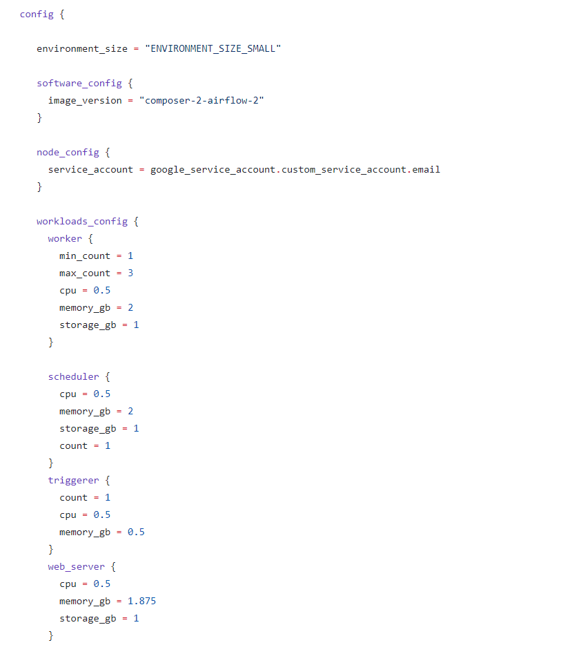

## **Automated Cloud Composer Environment Deployment**

### Configuration

| Parameter | Default Value | Description |
|---|---|---|
| projectId | - |  Name of the Google Cloud project |
| CreateComposer | true | Execute the deployment for Cloud Composer. |
| location | us-central1 | The region where the environment is located. |
| serciceAccountName | custom-service-account | User-managed service account for Cloud Composer environments.
| composerEnvName | dev-composer | Name of the cloud composer environment. |

Note : For composerEnvName, name must start with a lowercase letter followed by up to 62 lowercase letters, numbers, or hyphens, and cannot end with a hyphen. The environment name is used to create subcomponents for the environment, so you must provide a name that is also valid as a Cloud Storage bucket name. See [Bucket naming guidelines](https://cloud.google.com/storage/docs/buckets#naming) for a list of restrictions.

By Default, following composer configuration will be applied.

